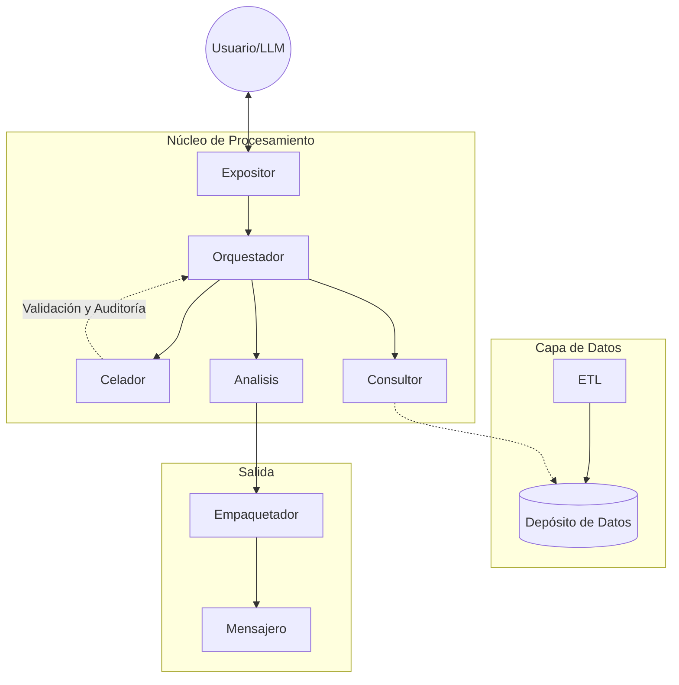

<div align="center">
  
  <h1><em><strong>Casandra</strong></em></h1>
  <h3><i>Los datos hablan por sí solos</i></h3>

  [](https://www.python.org/)
  []()
  [](https://github.com/psf/black)
</div>

---

**Casandra** es una IA analista diseñada para convertir datos crudos —principalmente de seguridad pública— en diagnósticos claros, patrones detectables y propuestas accionables. No es un chatbot opinólogo ni una bola de cristal; es más bien una ingeniera de datos con criterio.

> **"Casandra no predice el futuro. Lee el presente con lupa, para que el futuro no te agarre distraído."**

##  ¿Qué hace Casandra?

En esencia, Casandra realiza tres tareas fundamentales con precisión de ingeniería:

### 1. Ingesta y Curaduría (El Método)
Ingiere y limpia datos reales (CSV, JSON, bases históricas). Quita duplicados, normaliza formatos y calcula métricas útiles.
*   **Sin magia, hay método:** ETL robusto que transforma el caos en estructuras consultables y normalizadas.

### 2. Análisis y Detección
Busca patrones, anomalías, tendencias temporales y espaciales. Clasifica, cruza variables y mide gravedad.
*   **Diagnóstico crudo:** La idea es responder qué está pasando y dónde duele más, sin adornos.

### 3. Interpretación y Propuesta
A partir del análisis, genera lecturas estratégicas y recomendaciones razonadas.
*   **Soporte a la decisión:** No decide por los humanos, pero les entrega mejores cartas para que ellos decidan con fundamento.

---

##   Filosofía: Auditable y Ética

Un rasgo clave de Casandra es su transparencia.
*   **Trazabilidad**: Cada conclusión se apoya en datos rastreables y reglas explícitas.
*   **Ética**: Nada de "caja negra" o "porque la IA lo dijo".
*   **Seguridad**: Validación estricta de entradas y manejo de errores proactivo.

---

## 🏗️ Arquitectura del Sistema

Casandra está construida como un sistema modular que permite escalar, cambiar fuentes de datos o adaptarse a otros dominios (logística, salud pública, educación, etc.).

### Mapa de Componentes y Flujo



### Estructura del Proyecto

La arquitectura se refleja directamente en la organización del código, separando las responsabilidades de cada módulo:

```text
casandra/
├── Analisis/        # Motores de inferencia (Métricas, Patrones, Heurística)
├── Auxiliares/      # Utilidades transversales (Config, Reloj, Logging)
├── Celador/         # Guardián del sistema (Validaciones, Manejo de Errores, Auditoría)
├── Consultor/       # Interfaz de lectura de datos (Repository Pattern)
├── dominio/         # Definiciones de tipos, contratos y reglas de negocio puras
├── Empaquetador/    # Formateo de respuestas (JSON, Markdown, Gráficos)
├── Etl/             # Ingesta y limpieza (Cargador, Curador, Depósito)
├── Expositor/       # Punto de entrada / API (FastAPI)
├── Herramientas/    # Capacidades deterministas ejecutables
├── Mensajero/       # Envío y entrega de resultados
├── Orquestador/     # Cerebro que coordina el flujo de ejecución
└── docs/            # Documentación del proyecto
```

### Flujo de Ejecución (Runtime)

Casandra opera bajo un **modelo de razonamiento orquestado**, donde un **LLM actúa como intérprete de intención**, no como ejecutor directo.

1. **Interacción inicial**  
   El usuario interactúa con Casandra a través del `Expositor`. Esta interacción **no ejecuta lógica directamente**: se traduce en una **consulta semántica** que es evaluada por un **LLM**.

2. **Selección de Pipeline (Decisión Cognitiva)**  
   El **LLM analiza la intención**, el contexto y las capacidades disponibles, y **define un pipeline explícito de herramientas**:
   - Qué módulos se requieren  
   - En qué orden deben ejecutarse  
   - Qué datos necesita cada paso  

   > Aquí ocurre lo esencial:  
   > **el LLM decide *qué hacer*, pero no *cómo hacerlo*.**

3. **Validación y Control**  
   El pipeline propuesto es entregado al `Celador`, que:
   - Valida entradas, contratos y permisos  
   - Audita coherencia y seguridad  
   - Rechaza o ajusta flujos inválidos  

4. **Ejecución Determinista**  
   El `Orquestador` toma el pipeline aprobado y **ejecuta cada herramienta en orden estricto**, sin improvisación:
   - Consulta datos vía `Consultor`
   - Ejecuta motores de `Analisis`
   - Invoca `Herramientas` deterministas cuando aplica  

   > El Orquestador **no razona**, solo coordina.  
   > La inteligencia decide, la ingeniería ejecuta.

5. **Empaquetado y Entrega**  
   Los resultados parciales y finales se envían al `Empaquetador`, que:
   - Estructura la salida (JSON, Markdown, dashboards)
   - Adjunta evidencia y trazabilidad (`provenance`)  

   El `Mensajero` entrega la respuesta final al usuario.

---

<div align="center">
  <sub>German Uriel Evangelista Martinez © 2025</sub>
</div>
